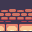

# bmp
Load, create and slice bmp files.

```cpp
#include <stdio.h>
#include <stdlib.h>
#include "bmp.h"

int main()
{
	BMP_Bmp walls_bmp = BMP_LoadBmp("walls.bmp");

	if (walls_bmp.pixels) {
		BMP_Bmp sliced_wall_bmp = BMP_SliceBmp(&walls_bmp, 64, 32, 32, 32);
		if (sliced_wall_bmp.pixels) {
			BMP_CreateBmp("sliced_wall.bmp", &sliced_wall_bmp);
		}

		int sliced_count = BMP_BatchSliceBmpAndWriteToSeperateFiles("walls", walls_bmp.pixels, walls_bmp.width, walls_bmp.height, 32, 32);
		// int sliced_count = BMP_BatchSliceBmpAndWriteToSeperateFiles("walls", &walls_bmp, 32, 32);
	}

	return 0;
}
```

## Example Bmp Image
<br>
## Example Bmp Slices


<br>


<br>




<br>

### Pixel Art Sources <br>
https://pixelfrog-assets.itch.io/kings-and-pigs<br>
https://rvros.itch.io/animated-pixel-hero
