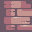

# bmp
Load, create and slice bmp files.

```cpp
#include <stdio.h>
#include <stdlib.h>
#include "bmp.h"

int main()
{
	BMP_Bmp hero_bmp = BMP_LoadBmp("hero.bmp");
	if (hero_bmp.is_valid) {
		BMP_CreateBmp("new_hero.bmp", &hero_bmp);

		BMP_Bmp sliced_hero_bmp = BMP_SliceBmp(hero_bmp.pixels, hero_bmp.width, hero_bmp.height,
		                                       0, 0, hero_bmp.width, hero_bmp.height);
		if (sliced_hero_bmp.is_valid) {
			BMP_CreateBmp("sliced_hero.bmp", sliced_hero_bmp.pixels,
			              sliced_hero_bmp.width, sliced_hero_bmp.height);
		}
	}

	BMP_Bmp walls_bmp = BMP_LoadBmp("walls.bmp");

	if (walls_bmp.is_valid) {
		BMP_Bmp sliced_wall_bmp = BMP_SliceBmp(&walls_bmp, 64, 32, 32, 32);
		if (sliced_wall_bmp.is_valid) {
			BMP_CreateBmp("sliced_wall.bmp", &sliced_wall_bmp);
		}

		int sliced_count = BMP_BatchSliceBmpAndWriteToSeperateFiles("walls", walls_bmp.pixels, walls_bmp.width, walls_bmp.height, 32, 32);
		// int sliced_count = BMP_BatchSliceBmpAndWriteToSeperateFiles("walls", &walls_bmp, 32, 32);
	}

	return 0;
}
```

# Walls
<br>
# Slices


<br>
..............................<br>


<br>
